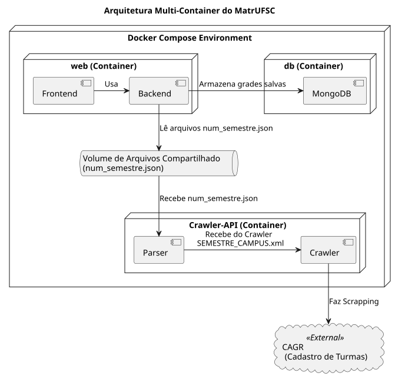

# MatrUFSC

MatrUFSC é uma ferramenta de planejamento e organização de grade curricular. Este projeto não tem nenhuma relação com o CAGr ou com outros sistemas oficiais da PROGRAD.

---

## Arquitetura do Projeto

O Projeto é containerizado em docker, separado por 3 serviços distintos:

- **web:** Frontend e uma parte do backend (Server Side Rendering) do projeto, é nesse serviço que o usuário irá interagir.
- **crawler-api:** Esse serviço é resposável por fazer o scrapping do cadastro de turmas do cagr e converter os dados para o formato JSON que o container web possa usar;
- **db:** Banco de dados para guardar grades feitas. Ele será usado diretamente pelo container web.

---

## Pré-requisitos

Antes de começar a desenvolver, você precisará ter instalado em sua máquina:

- Docker
- Docker Compose
  Mais detalhes de como instalar estão disponíveis em `docs/docker.md`

---

## Como executar

Siga os passos abaixo para executar o programa:

1. Clonar esse repositório: `git clone https://github.com/pet-comp-ufsc/matrufsc.git`
2. Entrar na pasta: `cd matrufsc`
3. Iniciar os containers: `docker compose up -d`
